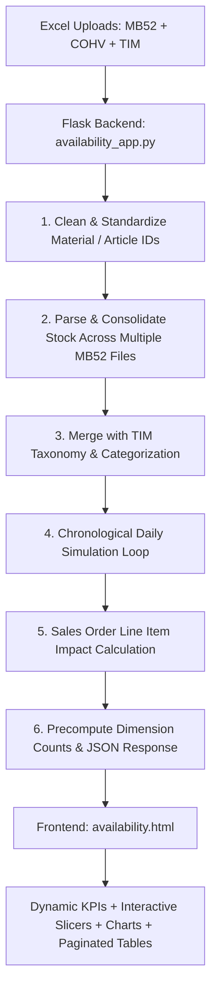

# Supply Chain Stock & Demand Availability Prediction System
### A Student's Beginner-Friendly Guide to the Architecture, Data Flow, and Logic

---

## 1. What Does This Project Do?

In modern manufacturing and retail companies (like IKEA, Amazon, or automotive factories), two crucial questions are asked every single day:
1. **"What inventory do we currently have sitting in our warehouse?"**
2. **"What orders and requirements are coming in from our stores and customers?"**

If customer demand exceeds warehouse inventory, a **stockout** occurs—meaning you run out of products, customers wait, orders are delayed, and the company loses money.

This application connects and merges multiple enterprise data files (SAP / ERP exports) and produces:
- **Instant Stock Depletion Forecasts** (Exactly which date will a material run out?)
- **Risk Classification** (`CRITICAL STOCKOUT`, `STOCKOUT RISK`, `SUFFICIENT STOCK`)
- **Customer Sales Order Fulfillment Simulation** (Which sales orders can be shipped in full vs. partial?)
- **Interactive Multi-Dimension Slicers** (Category, Sub-Category, Country, Article Status, Project Items)

---

## 2. The Input Files Explained (SAP / ERP Data Sources)

| File Name | Real-World Enterprise Purpose | Key Columns Extracted |
| :--- | :--- | :--- |
| **MB52 (Stock File)** | A snapshot of warehouse inventory right now. Can upload multiple files (e.g. across multiple storage locations). | `Material`, `Material Description`, `Unrestricted` (units on shelf), `Value Unrestricted` (monetary value in SAR) |
| **COHV (Requirements)** | Planned and Production Orders representing future demand or manufacturing requirements. | `Material`, `Material Description`, `Requirement Date`, `Requirement Qty`, `Sales Document` |
| **TIM (Article Master)** | Master taxonomy mapping articles to business categories and origins. | `Article`, `Category`, `Sub Category`, `Country`, `Article Status` |

---

## 3. System Architecture & Data Flow

Here is how data flows from your uploaded Excel spreadsheets to the web dashboard:



---

## 4. The Core Algorithm: Chronological Inventory Depletion

How does the Python engine know the exact date stock will run out?

Let's look at a simple example:
- **Starting MB52 Stock**: 100 units
- **Requirement Schedule**:
  - Oct 10: 30 units
  - Oct 15: 50 units
  - Oct 20: 40 units

### Step-by-Step Simulation:
1. **Oct 10**: Stock drops from `100` to `70` (Remaining: 70 units). Status: Healthy.
2. **Oct 15**: Stock drops from `70` to `20` (Remaining: 20 units). Status: Healthy.
3. **Oct 20**: Stock drops from `20` to `-20` (Shortage: 20 units).
   - **Depletion Date flagged**: `2026-10-20`
   - **Days until Depletion**: Days between today and Oct 20.
   - **Risk Classification**: `STOCKOUT RISK` (or `CRITICAL STOCKOUT` if starting stock was already 0).

---

## 5. Why Did the Virtual Environment (`venv`) Matter?

When you saw this error in your terminal:
```bash
ModuleNotFoundError: No module named 'pandas'
```
Here is why that happened:
- Linux systems have a global system Python installation, which does not have third-party packages installed by default to keep the operating system stable.
- The project has a dedicated **Virtual Environment** folder named `venv/` containing all required libraries (`pandas`, `Flask`, `openpyxl`, `XlsxWriter`).
- When running `py main.py` without activating the virtual environment, the system used the global Python.
- Running:
  ```bash
  source venv/bin/activate
  python main.py
  ```
  tells your terminal to use `venv/bin/python`, where all packages are installed and ready.

---

## 6. How the Frontend Slicers Work at Lightning Speed

When datasets have tens of thousands of rows, filtering everything on every click causes browser lag. To prevent this, two techniques are used:

### A. Pre-Indexing & Slicer Buckets
At startup, `availability_app.py` precomputes the unique sets of Categories, Sub-Categories, Countries, and Project tags. The frontend organizes them into Javascript `Set` and `Map` structures for $O(1)$ lookups.

### B. Virtual Pagination
Instead of injecting 10,000 HTML `<tr>` table rows into the DOM at once (which freezes the browser), the frontend uses client-side pagination:
- Slices the array into chunks of 50, 100, 250, or 500 records.
- Renders only the active page in milliseconds.

---

## 7. How to Run the Application

```bash
# 1. Open your terminal in the project directory:
cd /home/lone-warrior/Downloads/harsh2-main

# 2. Activate the Python virtual environment:
source venv/bin/activate

# 3. Start the Flask application:
python main.py

# 4. Open your browser and navigate to:
# http://127.0.0.1:5000
```
